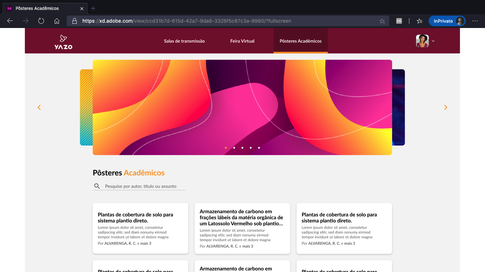

<h1 align="center">
  
</h1>

<p align="center">
  
  
  
</p>

<p align="center">
  
  
  
  <a href="https://github.com/gabrielmaialva33/sos/commits/master">
    
  
  </a>
</p>

<br>
<p align="center">
    <a href="README.md">English</a>
    ·
    <a href="README-pt.md">Portuguese</a>
</p>

<p align="center">
  <a href="#bookmark-about">About</a>&nbsp;&nbsp;&nbsp;|&nbsp;&nbsp;&nbsp;
  <a href="#computer-technologies">Technologies</a>&nbsp;&nbsp;&nbsp;|&nbsp;&nbsp;&nbsp;
  <a href="#wrench-tools">Tools</a>&nbsp;&nbsp;&nbsp;|&nbsp;&nbsp;&nbsp;
  <a href="#package-installation">Installation</a>&nbsp;&nbsp;&nbsp;|&nbsp;&nbsp;&nbsp;
  <a href="#memo-license">License</a>
</p>
</strong>
<br>

<p align="center">
    
</p>

## :bookmark: About

**MyYazoApp** is a small project to familiarize me with the **Ruby language**. Work** by **[Gabriel Maia](https://github.com/gabrielmaialva33)**.

<br>

## :computer: Technologies

- **[Ruby](https://www.ruby-lang.org/pt/)**
- **[Rails](https://rubyonrails.org/)**
- **[PostgreSQL](https://www.postgresql.org/)**

<br>

## :wrench: Tools

- **[VisualStudio Code](https://code.visualstudio.com/)**
- **[RubyMine](https://www.jetbrains.com/ruby/)**
- **[Insomnia](https://insomnia.rest/)**
- **[Google Chrome](https://www.google.com/chrome/)**
- **[DataGrip](https://www.jetbrains.com/pt-br/datagrip/)**

<br>

## :package: Installation

### :heavy_check_mark: **Prerequisites**

The following software must be installed:

- **[Ruby](https://www.ruby-lang.org/pt/)**
- **[Git](https://git-scm.com/)**
- **[NPM](https://www.npmjs.com/)** or **[Yarn](https://yarnpkg.com/)**
- **[PostgreSQL](https://www.postgresql.org/)**

<br>

### :arrow_down: **Cloning the repository**

```sh
  $ git clone https://github.com/gabrielmaialva33/my-yazo-api.git
```

<br>

### :arrow_forward: **Running the applications**

- :package: API

```sh
  $ cd
  # Dependencies install.
  $ bundle # or bundle install
  # Data base creation.
  $ rails db:create
  # Data base creation.
  $ rails db:migration
  # API start
  $ rails s
```

## :memo: License

This project is under the **MIT** license. [MIT](./LICENSE) ❤️

Liked? Leave a little star to help the project ⭐
